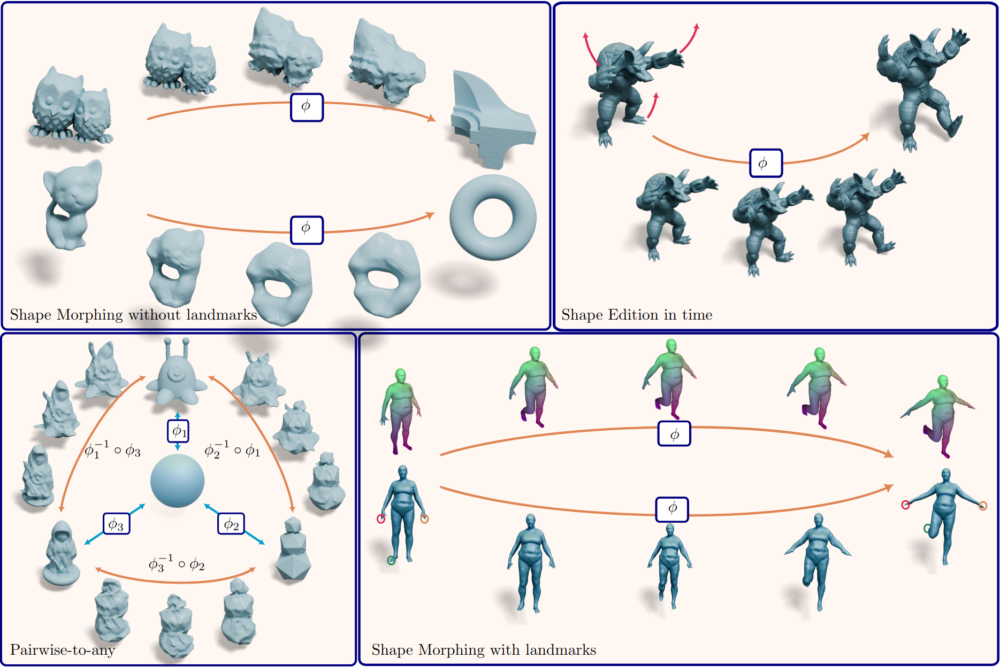
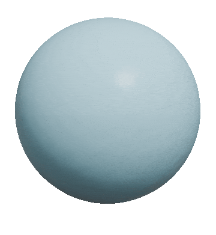

# explicit_flows_for_implicit_surfaces
Repository of the code for the paper [*Explicit flows for implicit surfaces*, Camille Buonomo, Julie Digne, Raphaëlle Chaine, Siggraph2026](https://hal.science/hal-05622054)



## Prerequisites

1. A python [conda](https://www.anaconda.com/) like virtual environment manager
2. (GPU only) nvcc 12.6 and CUDA 13.0 with 16GB memory
3. (Optional) A software to visualize Polygon File Format (.ply) meshes, for exemple [MeshLab](https://www.meshlab.net/)


## Clone
```
git clone https://github.com/camillebnm/explicit_flows_for_implicit_surfaces.git
```
## Installation
```
cd explicit_flows_for_implicit_surfaces
conda create -n EFIS pip
conda activate EFIS
pip install -r requirements.txt
```

## TLDR

Minimum example (after installation and activation)
```
python train.py experiments/direct_morphing/morph_gts-gtc.yaml
python reconstruct.py results/morph_gts-gtc_interpolation/ --modes meanw -t linspace 24 -r 256
```
The outputted files are standard .ply files in the folder `results/morph_gts-gtc_interpolation/outputs` and can be visualized by any standard software such as meshlab, blender, paraview ...

## Code organization
This code is built upon the code provided by the authors of [Neural Implicit Surface Evolution using Differential Equations](https://arxiv.org/abs/2201.09636). Their code is available [here](https://dsilvavinicius.github.io/nise/). It follows roughly the same architecture:


The common code is contained in the `src` folder:
* `dataset.py` - contains the sampling and data classes
* `diff_operators.py` - implements differential operators (gradient, hessian, jacobian, curvatures)
* `meshing.py` - creates meshes through marching cubes
* `model.py` - contains the networks and layers implementation
* `util.py` - contains miscelaneous functions and utilities
* `losses/loss_edition.py`; `losses/loss_morphing.py` - contains loss functions for different experimental settings
*  `models/` - contains the implemantations of others state of the art methods (Only our architecture is implemented for now)

The main training and reconstruction scripts are in the root folder:
* `train.py` - trains an interpolation between two neural implicit SDFs 
* `reconstruct.py` - given a trained model (pth) reconstructs the mesh using marching cubes at values `t` given by the user

Other folders are organised as follow : 
* `results/` - contains the results of each experiment 
* `results/pretrained/` - contains our trained morphing networks
* `experiments/` - contains the configuration files (yaml) to run predefined experiments. They are separated in `edition/` and `direct_morphing/`.
* `ni/` - contains the neurals SDF of the test shapes 
* `data/` - contains the meshes of the test shapes

## Run an experiment


Given a proper configuration file (see folder `experiments/`), an experiment can be run as follows
```
python train.py experiments/<configuration_file.yaml>
```
Practical example : 
```
python train.py experiments/direct_morphing/morph_gts-gtc.yaml
```
## Reconstruct from a model

To reconstruct meshes from the implicit representation, you can use the file `reconstruct.py` as follows: 
```
python reconstruct.py <path(s)_to_experiments/> --modes <render_mode(s)> -t <time_range> -r <marching_cube_grid_resolution>
```
There are 3 possible modes : 
* `forw` : The first shape and the forward of the flow are used for the reconstruction
* `backw` : The second shape and the backward of the flow are used for the reconstruction
* `meanw` : The blending of the 2 above reconstruction is used

The parameter `-t` has 3 uses : 
* `-t <list_of_float>` : `-t -1. 0. 1.` reconstructs the surface at specified times
* `-t linspace <int>` : `-t linspace 24` reconstructs the surface for each time in `torch.linspace(0,1,<int>)`

The results are saved in `<first_path_to_experiments/outputs/>`

Practical example :

```
python reconstruct.py results/morph_gts-gtc_interpolation/ --modes meanw -t linspace 24 -r 256
```
The reconstructed outputs can then be viewed in (e.g.) meshlab with the command : 
```
meshlab results/morph_gts-gtc_interpolation/outputs/meanw_time_*
```
    



## Replicate results
To replicate the first of figure 5 of our paper, please run the following : 
```
python reconstruct.py results/pretrained/morph_armadillo-blob_interpolation/ --modes meanw -t linspace 6 -r 256
meshlab results/pretrained/morph_armadillo-blob_interpolation/outputs/meanw_time_0*

```
## Related work

- NISE [Neural Implicit Surface Evolution using Differential Equations](https://arxiv.org/abs/2201.09636) [github repo](https://dsilvavinicius.github.io/nise/)
- INSD [Implicit Neural Surface Deformation with Explicit Velocity Fields](https://openreview.net/forum?id=sYAFiHP6qr) [github repo](https://github.com/Sangluisme/Implicit-surf-Deformation)
- SIREN [Implicit Neural Representations with Periodic Activation Functions](https://www.vincentsitzmann.com/siren/)
- NFGP [Geometry Processing with Neural Fields](https://proceedings.neurips.cc/paper_files/paper/2021/file/bd686fd640be98efaae0091fa301e613-Paper.pdf)
- ADADIV [Volume Preserving Neural Shape Morphing](https://hal.science/hal-05622054)

## Citation
    
If you find this code useful, please cite
    
```
@article{buonomo2026,
author={Buonomo, Camille and Digne, Julie and Chaine, Raphaëlle},
title={Explicit flows for implicit surfaces},
year={2026},
journal={ACM Transactions on Graphics, 2026, 45 (4), pp.115. }
}
```
## Acknowledgements
    
This work was partially funded by ANR-23-PEIA-0004 (PDE-AI).
This project was provided with computing AI and storage resources by GENCI at IDRIS thanks to the grant 2025-AD010616975 on the supercomputer Jean Zay’s V100 partition.

